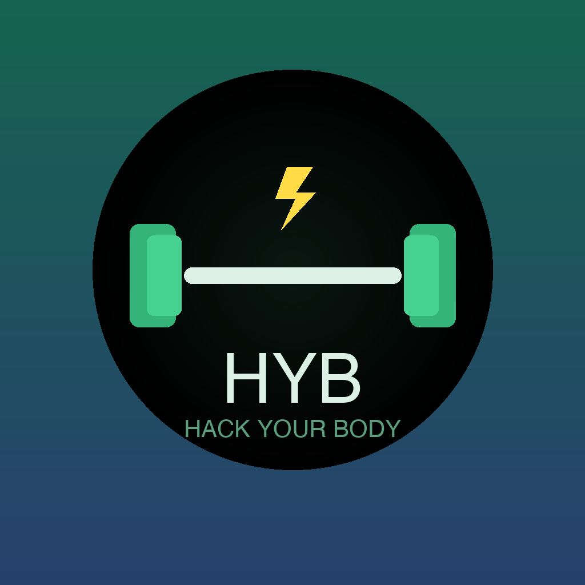

<p align="center">
  
</p>

<h1 align="center">Hack Your Body</h1>

<p align="center">
  <strong>Your AI-powered body recomposition companion for iOS</strong>
</p>

<p align="center">
  
  
  
  
  
</p>

---

**Hack Your Body** is a native iOS application designed for people serious about body recomposition — building muscle while losing fat. It combines AI-generated workout programs, nutrition planning, daily habit tracking, progress photography, and Apple Health integration into a single, cohesive experience.

The app leverages OpenAI's GPT-4o for intelligent content generation (workouts, recipes, meal plans, coaching advice) and GPT-4o-mini for cost-effective bulk generation, all personalized to your profile, goals, and history.

## Screenshots

<p align="center">
  
  
  
  
</p>

<p align="center">
  
  
  
  
</p>

> **Note:** Add your own screenshots to the `screenshots/` directory. Recommended names: `dashboard.png`, `workout.png`, `live-workout.png`, `recipes.png`, `progress-photos.png`, `measurements.png`, `photo-compare.png`, `checklist.png`.

## Features

### AI-Powered Workout Programs
- Fully personalized training programs generated by GPT-4o based on your profile (weight, height, age, goals, equipment, training frequency)
- Support for multiple split types: Push/Pull/Legs, Upper/Lower, Full Body, Bro Split
- Session-by-session workout tracking with per-set logging

### Adaptive Training Intelligence
- **Per-set logging** — every set you perform is recorded with weight, reps, and timestamp
- **Personal Records (PR) detection** — automatic detection of new PRs (max weight, estimated 1RM via Epley formula) with celebration animation
- **Previous session reference** — see what you lifted last time for each exercise, with auto-prefill
- **Stagnation detection** — AI analyzes your progression history and flags plateaus with actionable recommendations
- **Exercise history** — charts for weight progression, estimated 1RM, and total volume per exercise
- **HealthKit workout write** — completed sessions are saved to Apple Health as strength training workouts

### Progress Photography
- Take progress photos via **camera** or select from **photo library**
- Categorize photos by **pose** (Front, Side, Back)
- **Timeline gallery** with monthly grouping and pose filtering
- **Before/After comparison** — side-by-side view with auto-selection, weight delta, and day count
- Optional body weight and notes per photo

### Body Measurements Tracking
- Track 9 body metrics: chest, shoulders, neck, biceps (L/R), waist, hips, thighs (L/R)
- Optional body fat percentage
- **Evolution cards** showing deltas between measurements with color-coded indicators
- **Charts** per body part with Swift Charts (line graphs, area fills, multi-metric overview)
- Waist-to-hip ratio calculation
- Pre-fill from last measurement for quick updates

### AI-Generated Nutrition
- Recipes generated for any meal type (breakfast, lunch, dinner, snacks) with full macro breakdown
- Complete daily meal plans matching your calorie and macro targets
- Shopping list generation from meal plans
- Recipe favorites and search

### Daily Checklist
- AI-suggested daily habits based on your goals
- Compliance tracking with history and streak system
- Custom checklist items

### Apple Health Integration
- **Read**: steps, active calories, resting heart rate, sleep duration, body weight
- **Write**: strength training workouts, body weight
- Compatible with third-party devices (Xiaomi Smart Band, Fitbit, etc.) via Apple Health bridge

### AI Chat
- Free-form conversation with a fitness-specialized GPT-4o assistant
- Context-aware coaching advice
- Progressive overload suggestions per exercise

### Dashboard
- Daily overview with greeting, streak badge, checklist progress
- Today's workout card with quick-start
- Body progress summary widget (latest photo + measurement deltas)
- HealthKit stats (steps, calories, heart rate, sleep, weight)

## Tech Stack

| Layer | Technology |
|-------|-----------|
| **UI** | SwiftUI |
| **Data** | SwiftData (local persistence) |
| **Health** | HealthKit |
| **AI** | OpenAI API (GPT-4o, GPT-4o-mini) |
| **Charts** | Swift Charts |
| **Camera** | PhotosUI + UIImagePickerController |
| **Project Gen** | XcodeGen |

## Architecture

```
HackYourBody/
├── App/                    # App entry point, ContentView, tab navigation
├── Models/                 # SwiftData @Model classes (12 models)
│   ├── UserProfile         # User profile, goals, macros
│   ├── WorkoutProgram      # AI-generated training programs
│   ├── WorkoutSession      # Individual training sessions
│   ├── ExerciseSet         # Exercises within a session
│   ├── SetLog              # Per-set performance data
│   ├── PersonalRecord      # PR tracking per exercise
│   ├── ProgressPhoto       # Progress photos with pose metadata
│   ├── BodyMeasurement     # Body measurement entries
│   ├── Recipe / MealPlan   # Nutrition data
│   ├── ChecklistDay/Item   # Daily habit tracking
│   └── ChatMessage         # AI chat history
├── ViewModels/             # @Observable view models
├── Views/                  # SwiftUI views organized by feature
│   ├── Dashboard/          # Main dashboard and summary cards
│   ├── Workout/            # Workout tracking, live session, PRs, history
│   ├── Progress/           # Photo gallery, compare, measurements, charts
│   ├── Recipe/             # Recipes, meal plans, shopping list
│   ├── Checklist/          # Daily checklist and history
│   ├── Profile/            # Profile, settings, HealthKit config
│   ├── AIChat/             # AI conversation
│   ├── Onboarding/         # First-launch onboarding flow
│   └── Components/         # Reusable UI components
├── Services/
│   ├── AIService           # OpenAI API integration
│   └── HealthKitService    # Apple Health read/write
└── Utilities/              # Extensions, constants
```

## Getting Started

### Prerequisites

- **Xcode 15+** (tested with Xcode 16)
- **iOS 17.0+** device or simulator
- **XcodeGen** — `brew install xcodegen`
- **OpenAI API key** (for AI features) — [Get one here](https://platform.openai.com/api-keys)

### Setup

```bash
# Clone the repository
git clone https://github.com/sebflorent/HackYourBody.git
cd HackYourBody

# Generate the Xcode project
xcodegen generate

# Open in Xcode
open HackYourBody.xcodeproj
```

Then in Xcode:
1. Select your **development team** in Signing & Capabilities
2. Build and run on your device or simulator
3. Complete the onboarding flow
4. Go to **Profile > Intelligence Artificielle** to enter your OpenAI API key

### API Key Security

The OpenAI API key is **never stored in the source code**. It is entered by the user at runtime and saved locally in `UserDefaults` on the device. For production use, migration to Keychain is recommended.

## Roadmap

- [x] **Adaptive Workout Tracking** — per-set logging, PR detection, stagnation analysis, HealthKit write
- [x] **Photo Progress & Body Measurements** — camera/gallery, timeline, before/after compare, measurement charts
- [ ] **AI Nutrition Logger** — snap a photo of your meal, GPT-4o Vision estimates macros automatically
- [ ] **Weekly AI Report** — automated weekly summary with insights, recommendations, and trend analysis
- [ ] **Apple Watch Companion** — live workout tracking on wrist, checklist glanceable, complications

## Contributing

Contributions are welcome! Feel free to open issues or submit pull requests.

## License

This project is open source and available under the [MIT License](LICENSE).

---

<p align="center">
  Built with SwiftUI, SwiftData, and a lot of protein.
</p>
